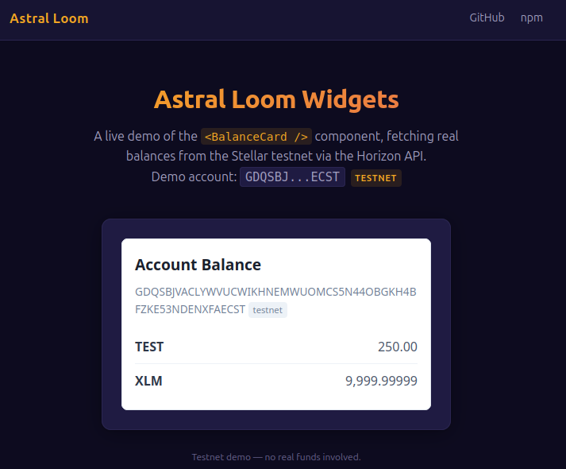
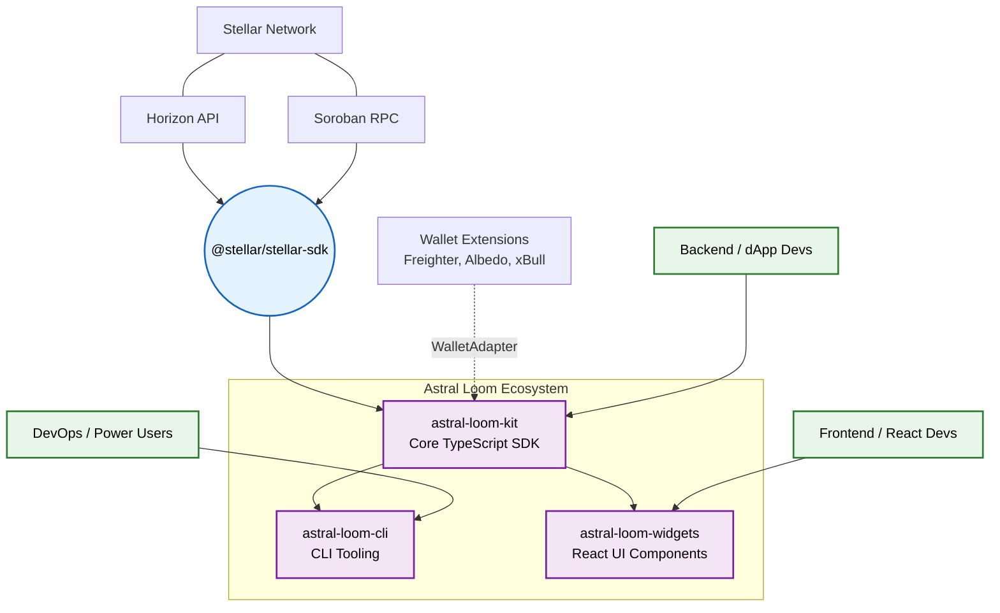

<div align="center">
  <h1>🧩 Astral Loom Widgets</h1>
  <p><strong>Embeddable React components for Stellar dApp frontend development.</strong></p>
  
  [](https://www.npmjs.com/package/astral-loom-widgets)
  [](https://github.com/astral-loom/astral-loom-widgets/actions/workflows/ci.yml)
  [](https://opensource.org/licenses/MIT)
  
  **[Live Demo](https://astral-loom-widgets.vercel.app)**
  
  🌐 Website: https://astral-loom-site.vercel.app
</div>

## Demo



(A live interactive demo is also available: [https://astral-loom-widgets.vercel.app](https://astral-loom-widgets.vercel.app))

---

## 📖 Overview

`astral-loom-widgets` provides embeddable UI components for Stellar dApp frontend development. These React components are pre-wired to handle Stellar network data, saving you from rebuilding basic transaction and balance displays from scratch.

### 🏗️ Architecture

Developed with modern frontend practices:
- Built in React & TypeScript.
- Explorable via Storybook.
- Drop-in UI for components like the `<BalanceCard />`.

### 🌍 Ecosystem Architecture

`astral-loom-widgets` is the UI component layer of the Astral Loom ecosystem.



---

## 🚀 Quick Start

### 1. Installation

Install using npm or yarn:

```bash
npm install astral-loom-widgets react react-dom @stellar/stellar-sdk
```

### 2. Usage

Import and use the pre-built components directly in your app:

```tsx
import { BalanceCard } from 'astral-loom-widgets';

function App() {
  return (
    <BalanceCard 
      publicKey="GA...YOUR_ACCOUNT"
      network="testnet"
      balances={[
        { assetCode: 'XLM', balance: '100.00' },
        { assetCode: 'USDC', balance: '50.00' }
      ]}
    />
  );
}
```

---

## 💡 Examples

Check out the [examples/demo-app/](examples/demo-app/) directory for a complete Vite + React demo application showcasing the `<BalanceCard />` component in action.

See [site/](site/) for the project landing page.

---

## 🤝 Community & Maintainers

We are committed to fostering a welcoming environment. Please read our [Code of Conduct](CODE_OF_CONDUCT.md) before participating. If you discover a vulnerability, please review our [Security Policy](SECURITY.md) for reporting instructions.

Join the discussion and get support:
* **Community Link**: [Stellar Developer Discord](https://discord.gg/5aprtMSyR)

| Maintainer | Role |
|------------|------|
| Temmy2026 | Core Developer |

---

## 🛠️ Contributing

We welcome contributions! Please see our [CONTRIBUTING.md](CONTRIBUTING.md) for details on how to get started.

### 🧑‍💻 Contributors

[](https://github.com/astral-loom/astral-loom-widgets/graphs/contributors)
